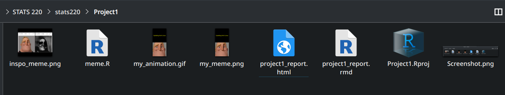
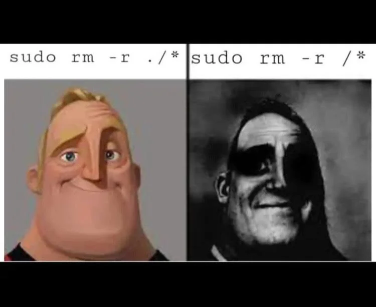

```{r setup, include=FALSE}
knitr::opts_chunk$set(echo=TRUE, message=FALSE, warning=FALSE, error=FALSE)
```

```{css}

body {
	background: linear-gradient(335deg, #23a6d5, #23d5ab, #ee7752, #e73c7e);
	background-size: 800% 800%;
	animation: gradient 10s ease infinite;
	height: 100vh;
}

@keyframes gradient {
	0% {
		background-position: 0% 50%;
	}
	50% {
		background-position: 100% 50%;
	}
	100% {
		background-position: 0% 50%;
	}
}


h2{
  color: #ffffff;
  text-shadow: 2px 2px 4px rgba(0, 0, 0, 0.6);
}

h3{
  color: #E6E6FA
}

h1{
  font-size: 28px
  font-family: 'Sego UI', sans-serif;
  color: #4568DC;
}

h4{

  color: black

}

```

## Project requirements

For the Github requirements, I have created a Github repository named stats220 that is public to see. The folder that encompasses the work I have done for this project named Project1, and any other future projects, will be within this repository. For my README.md, I have clearly stated the reason for the repository and have shown the ability to use the required markdown syntax as in I have used two different levels of headers, one for the title and one for subtitles; I have used ordered bullet points for the projects and unordered to list the purpose of the repo; usage of both bold and italics along with a link to the stats220 course outline. [HERE](https://github.com/CSArman/stats220/) is the link for my repository.



## My meme

#### The inspiration meme




The key parts that I re-created was using the Mr Incredible images, thus showing the contrast of one idea to another by changing how traumatised Mr Incredible looks. I removed the side to side stacks of the meme to show just one stack at a time that, through smooth animation and morphing, animated to the next section of the meme; whereby Mr Incredible becomes more and more traumatised as the text caption changes.

<br>
<br>
<br>


```{r meme-code, eval=TRUE}
# Initialising the libraries required.
library(magick)
library(tidyverse)

meme_text = c("Updating Arch Linux", "Updating Linux Mint", "Updating Windows", "Updating Gentoo")


# Initialising the different phases of Mr Incredible's face.
image_phase_1 = image_read("https://static.wikia.nocookie.net/the-uncanny-incredible/images/5/5f/Mibu_phase_1_%28original_hd%29.webp") %>%
  image_extent("600x600")

image_phase_2 = image_read("https://static.wikia.nocookie.net/the-uncanny-incredible/images/e/e7/Phase_2_HD.jpg/revision/latest?cb=20230619071456") %>%
  image_extent("600x600")

image_phase_3 = image_read("https://static.wikia.nocookie.net/the-uncanny-incredible/images/a/ad/7hd.png/revision/latest?cb=20230322173450") %>%
  image_extent("600x600")

image_phase_4 = image_read("https://static.wikia.nocookie.net/the-uncanny-incredible/images/7/71/Higher_definition_image%2C_as_seen_in_m%C3%BAsicos_C%C3%ADnicos%E2%80%99s_video..jpg/revision/latest/scale-to-width-down/1000?cb=20220215164526") %>%
  image_extent("600x600")


# Creating the textbox for each image

phase_1_textbox = image_blank(width = 600, height = 600, color = "black") %>%
  image_annotate(meme_text[1], size = 60, gravity = "center", color = 'yellow')

phase_2_textbox = image_blank(width = 600, height = 600, color = "black") %>%
  image_annotate(meme_text[2], size = 60, gravity = "center", color = 'yellow')

phase_3_textbox = image_blank(width = 600, height = 600, color = "black") %>%
  image_annotate(meme_text[3], size = 60, gravity = "center", color = 'yellow')

phase_4_textbox = image_blank(width = 600, height = 600, color = "black") %>%
  image_annotate(meme_text[4], size = 60, gravity = "center", color = 'yellow')


# Stacking the textbox over the appropriate image

frame_1 = c(phase_1_textbox, image_phase_1) %>%
  image_append(stack = TRUE)
frame_2 = c(phase_2_textbox, image_phase_2) %>%
  image_append(stack = TRUE)
frame_3 = c(phase_3_textbox, image_phase_3) %>%
  image_append(stack = TRUE)
frame_4 = c(phase_4_textbox, image_phase_4) %>%
  image_append(stack = TRUE)

# Presents the meme after knitting
frame_1
```

```{r animation-code, eval=FALSE}
# Creating the animation with morphed frames
animation = image_resize(c(frame_1, frame_2, frame_3, frame_4)) %>%
  image_morph(frames = 24) %>%
  image_animate(fps = 5, delay = 12, optimize = TRUE)

# Running the animation itself
animation

# Writing it as a gif
image_write(animation, "my_animation.gif")

```

### Animation:


## Creativity

I have demonstrated creativity through the way I have enhanced aspects of this project by additional means. Through the usage of the morph & animate functions along with specific frame rate and delay parameters, I have created a smooth transition between each frame of the meme.

I have also used additional CSS methods to enhance the visuals of the HTML. Utilising a gradient animation with the use of CSS code to create a smooth running background animation that gives the HTML more presence. This along with the use of text shadowing for certain headers to allow the text to be more visible while using the gradient animation.


## Learning reflection

### Important Ideas I have learned

I have learned how to theme and add flare to HTML pages using CSS code that affects the body, background and text of the HTML page. Along with that I have learned how to embed images and code within an HTML page, allowing me to show the image of my meme and its GIF. 

On the R side, I have learned how to use functions that come with the magick library effectively. Furthermore, using such functions in conjunction with pipes in tidyverse to modify and create images, which all came together to create my meme GIF as the output.

Throughout exploring Github, I have also learned how to use the git command to interact with my repository. Moreover, this also allowed me to learn about how to find differences in code between files using the 'diff' command, and how to patch the files using 'patch'. This even came in useful when I was using patches given by AMD on their Gitlab to fix a certain GPU bug.


### What I would like to learn more of

I would like to learn more about CSS and different types of theming I could use to give more style to HTML.

As this course is about data technologies, this has made me curious about how companies can manage such large pools of data. How would such data be used from and to be use with customers to enhance products. How would such data interact with the back-end and front end development. Furthermore, I am curious how such data is filtered out and managed by Engineers. How tools such as SQL and R could be used in real Data Science/Engineering products and applications.
