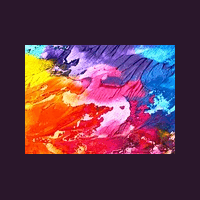
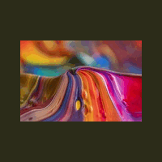

```{css, echo = FALSE}

body {
	background: linear-gradient(270deg, #23a6d5, #23d5ab, #ee7752, #e73c7e);
	background-size: 800% 800%;
	animation: gradient 10s ease infinite;
	height: 100vh;
}

@keyframes gradient {
	0% {
		background-position: 0% 50%;
	}
	50% {
		background-position: 100% 50%;
	}
	100% {
		background-position: 0% 50%;
	}
}


h2{
  color: #ffffff;
  text-shadow: 2px 2px 4px rgba(0, 0, 0, 0.6);
}

h3{
  color: #E6E6FA
}

h1{
  font-size: 28px
  font-family: 'Sego UI', sans-serif;
  color: #4568DC;
}

h4{

  color: black

}

```


```{r setup, include=FALSE}
knitr::opts_chunk$set(echo=TRUE, message=FALSE, warning=FALSE, error=FALSE)
library(tidyverse)
photo_data = read_csv("selected_photos.csv")
```

## Introduction

The two words I used were: "colourful painting" because art can have many different interpretations and results. Therefore, with these two words, I was hoping to get a variety of different paintings and colours instead of just one result repeated over and over.

This is the photo of the first few rows of royalty free photos: 

It seems like most of the photos I saw on the website were landscape or 1:1 aspect ratios. The tags I spotted the most were "art" and "brushes" as expected for a result about paintings. One of the photos had 900 likes but seemingly most of the others had less than 300 likes. Many of the photos have seem to have brushes and colouring utensils that complement the painting itself.

```{r code-chunk, eval = TRUE}
photo_data %>%
  select(pageURL) %>%
  knitr::kable(format = "html")
```



## Key features of selected photos
```{r}
options(scipen=999) # Remove scientific notation.

mean_downloads = mean(photo_data$downloads) %>%
  round()
median_views = median(photo_data$views) %>%
  round()
mean_comments = mean(photo_data$comments) %>%
  round()

mean_likes = mean(photo_data$likes) %>%
  round()
```

The mean downloads in my photo data set was $`r mean_downloads` \ downloads$

The median amount of views in photo data set was $`r median_views` \ views.$

The mean amount of comments for the photos in my set was $`r mean_comments` \ comments.$

The mean amount of likes for the photos in my data set was $`r mean_likes` \ likes.$


## Creativity



For my creativity section, I decided to use a random seed to make a random gif using the data in my selected_photos. By changing the set.seed from the '2199' that I have set it to by default, my code will make a completely different gif. Firstly, set.seed is as a sort of random number generator. Then I use a for loop to create 4 random values between 1 and the length of my data set. These 4 random values are then put into a vector and are then used to pick out photos from selected_photos to create a gif. By changing the set.seed value, the values selected for the vector are different and thus the photos picked out from selected_photos is different and thus a different gif is made.

## Learning reflection

I learned what JSON (Javascript Object Notation) is and how to use functions from the jsonlite library, such as the fromJSON function, to be able to use JSON urls. I have learned how to take JSON data and select only the rows I require and add extra rows that I would like to work with using the select() and mutate() functions. I have also learned how to use group_by() and summarise() to summarise data frames as groups. 

I would like to learn more about Javascript itself and how to use it with HTML and R. I would also like to further learn more about APIs and how they work. How does the API we used at the beginning work. I have heard of APIs being used in websites as a way to connect one service to another but how does that connection occur and what are the security considerations that go along with it.

## Appendix

```{r file='exploration.R', eval=FALSE, echo=TRUE}

```
